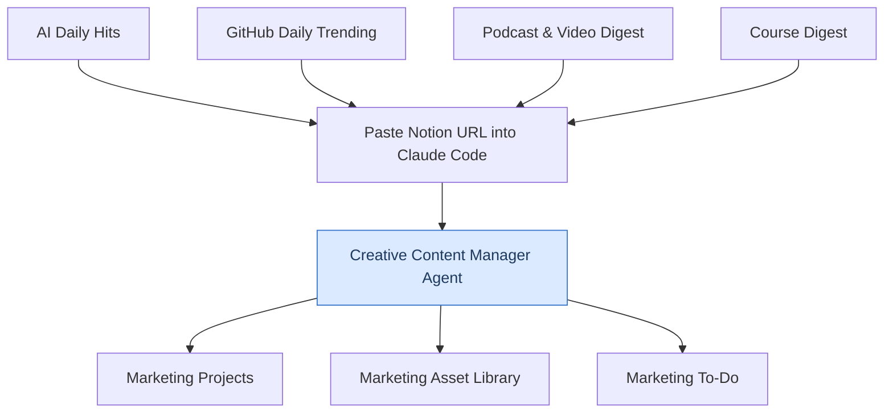

# Signal to Asset — Creative Content Manager

[](LICENSE)
[](https://www.python.org/)
[](https://claude.ai/code)
[](https://developers.notion.com/)
[]()

A Claude Code agent that turns Notion source entries into platform-ready content. Paste a Notion URL → the agent fetches the entry, asks for your hook and timeline, drafts 5 assets across LinkedIn, RedNote, X, and Notion Publish, then saves everything — assets and linked to-dos — to Notion via the API.

> **Owner:** Yingshi Liu · **Runtime:** Claude Code · **Integration:** Notion API v1

---

## How it works



**Trigger:** paste any source entry URL into Claude Code. The agent handles fetch → draft → approval gate → save.

---

## Agent modes

| Mode | Trigger | What it does |
|---|---|---|
| **Project Mode** | Paste a Notion page URL | Fetches entry, creates Marketing Project, approval gate, drafts 5 assets + to-dos |
| **Asset Creation** | "draft assets for [topic]" | Drafts posts/carousels for specified channels |
| **To-Do Generation** | "generate to-dos for [asset]" | Creates Review → Design → Publish checklist |

### Default assets per project — always 5, no approval needed

| # | Asset | Channel | Notes |
|---|---|---|---|
| 1 | LinkedIn (PM) | LinkedIn | Hook for product managers / operators / AI builders · under 1,300 chars |
| 2 | LinkedIn (DE) | LinkedIn | Hook for data / ML engineers · same insight, different angle |
| 3 | RedNote Carousel | RedNote | Caption + design brief + slide deck |
| 4 | X / Twitter | X | Punchy thread or single post |
| 5 | Notion Publish Page | Notion | Cleaned republish of source entry |

Extra channels (Substack, YouTube, etc.) require explicit user approval per run.

---

## Getting started

### Prerequisites

- Python 3.12+
- [Claude Code](https://claude.ai/code)
- A Notion integration with read/write access to your databases

### 1. Clone and install

```bash
git clone https://github.com/yingshill/signal-to-asset.git
cd signal-to-asset
pip3 install -r requirements.txt
```

### 2. Create a Notion integration

1. Go to [notion.so/my-integrations](https://www.notion.so/my-integrations) → **New integration**
2. Name it `signal-to-asset`, set capabilities to Read + Write
3. Copy the **Internal Integration Secret** → paste as `NOTION_TOKEN` in `.env`
4. Open each database in Notion → `...` → **Connections** → add `signal-to-asset`

### 3. Fill in `.env`

```bash
NOTION_TOKEN=secret_...

# Source databases (read)
NOTION_DB_AI_DAILY_HITS=
NOTION_DB_GITHUB_TRENDING=
NOTION_DB_PODCAST_DIGEST=
NOTION_DB_COURSE_DIGEST=

# Output databases (write)
NOTION_DB_MARKETING_PROJECTS=
NOTION_DB_MARKETING_ASSETS=
NOTION_DB_MARKETING_TODOS=
```

> Get database IDs from the Notion page URL — the 32-char hex string before `?v=`.

### 4. Verify the connection

```bash
python3 scripts/test_run.py
```

Expect 13/13 tests passing. This checks token validity, all DB connections, and create/archive round-trips for project, asset, and to-do rows.

### 5. Open in Claude Code

```bash
claude .
```

Claude Code reads `CLAUDE.md` and activates as the Creative Content Manager. Paste any source entry URL to trigger Project Mode.

---

## Repo structure

```
signal-to-asset/
├── CLAUDE.md                       ← agent instructions (loaded automatically by Claude Code)
├── ROADMAP.md                      ← milestones, backlog, artifact tracker
├── DECISIONS.md                    ← architecture and design decision log
├── requirements.txt
├── .env                            ← credentials (gitignored)
│
├── scripts/
│   ├── notion_client.py            ← Notion API base client (with 10-min file cache)
│   ├── fetch_entry.py              ← fetch and parse a source entry by URL
│   ├── create_project.py           ← find-or-create a Marketing Project row
│   ├── create_asset.py             ← create asset row + page body blocks
│   ├── create_todo.py              ← create task(s) in Marketing To-Do
│   ├── update_entry_status.py      ← update source entry status field
│   ├── test_run.py                 ← live integration test suite (13 checks)
│   └── eval_run.py                 ← human eval script (run after each Project Mode)
│
├── tests/
│   ├── test_notion_client.py       ← cache, extract_page_id, property helpers
│   ├── test_fetch_entry.py         ← field extraction, source DB identification
│   ├── test_create_project.py      ← fuzzy title matching, find-or-create logic
│   ├── test_create_asset.py        ← property building, content truncation, blocks
│   └── test_create_todo.py         ← single and batch todo creation, optional fields
│
├── artifacts/
│   ├── architecture-diagram/
│   │   ├── notion-light/           ← index.html + diagram.svg
│   │   └── dark-tech/              ← index.html + diagram.svg
│   ├── code-walkthrough-carousel/
│   │   └── notion-light/           ← index.html + diagram.svg
│   └── case-study/
│       └── notion-light/           ← index.html (carousel embedded)
│
├── docs/                           ← supplementary documentation
└── agent/                          ← legacy agent spec files
```

---

## Running tests

**Unit tests** (mocked, no Notion connection needed):

```bash
python3 -m pytest tests/ -v
# 62 tests, ~0.2s
```

**Integration tests** (live Notion API — requires `.env` filled):

```bash
python3 scripts/test_run.py
# 13 checks: token, all 7 DBs, create + archive for project/asset/todo
```

**Human eval** (run after each Project Mode session):

```bash
python3 scripts/eval_run.py
# Scores hook quality, content quality, channel fit (1–5) per asset
# Saves to .eval/<date>-<project-slug>.json
```

---

## Notion database access

| Database | Access | Purpose |
|---|---|---|
| AI Daily Hits | Read | Source entries |
| GitHub Daily Trending | Read | Source entries |
| Podcast & Video Digest | Read | Source entries |
| Course Digest | Read + Write | Source entries + status update |
| Marketing Projects | Write | Create / link project rows |
| Marketing Asset Library | Write | Create asset rows with page body |
| Marketing To-Do | Write | Create linked task rows |

All read operations are cached locally in `.cache/notion/` with a 10-minute TTL. Write operations bust the relevant cache entries automatically.

---

## Key design decisions

See [`DECISIONS.md`](DECISIONS.md) for the full log. Notable choices:

- **Trigger = URL paste**, not auto-trigger on Notion tag — keeps the agent human-initiated
- **Human approval gate** before any assets are saved — agent drafts, you decide
- **File-based cache** (not in-memory) — survives across separate Python processes
- **LinkedIn always = 2 assets** (PM + DE) — no exceptions
- **Agent never publishes** — it creates Draft rows and Review tasks only

---

## License

MIT — see [`LICENSE`](LICENSE).
