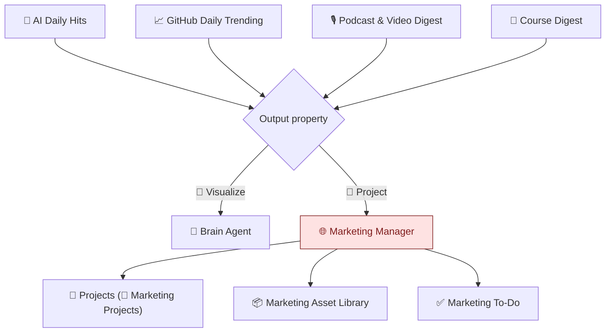

# 🌐 Marketing Manager Agent

A Notion custom agent that operationalizes marketing work after a workspace signal becomes a **📣 Project**. It creates and updates marketing project rows, drafts distribution assets, generates minimal production to-dos, and runs weekly publishing planning.

> **Owner:** Yingshi Liu's personal brand · **Type:** Notion custom agent · **Icon:** 🌐 globe (red)

---

## What it does

The agent operates in four modes:

1. **📣 Project Mode** — when a source entry is tagged `📣 Project` in `Output`, create/link a Marketing Project, fill its body from the Marketing Plan template, and (after human approval) generate the 4 default distribution assets.
2. **Asset Creation Mode** — draft posts, carousels, threads, and articles into the Marketing Asset Library with a strict structure (one asset per publishable deliverable, LinkedIn dual-audience rule, carousel design brief in body).
3. **✅ To-Do Generation Mode** — generate a minimal production checklist per asset (Review → Design → Publish for visuals; Review → Publish for text).
4. **📅 Weekly Planning Mode** — runs Sundays 8pm PT; surfaces top 3 `Ready` assets to publish that week and creates publish tasks.

## Where it sits in the system



**Boundary with Brain Agent:** Brain Agent owns signal scouting, database row creation in the 4 source DBs, and `🎨 Visualize` page-body drafts. Marketing Manager owns everything after the human sets `📣 Project`.

## Repo contents

```
.
├── README.md                       ← you are here
├── INSTRUCTIONS.md                 ← full agent instructions, single-file (canonical)
├── docs/
│   ├── 01-overview.md              ← role, voice, write access
│   ├── 02-project-mode.md          ← 📣 Project Mode (8 steps)
│   ├── 03-decision-tree.md         ← Quick Decision Tree
│   ├── 04-asset-creation.md        ← Asset Creation Mode + LinkedIn dual-audience rule
│   ├── 05-todo-generation.md       ← Production checklist patterns
│   ├── 06-weekly-planning.md       ← Sunday weekly plan run
│   ├── 07-alignment.md             ← Brain Agent boundary
│   └── 08-edge-cases.md            ← Rules and guardrails
└── config/
    ├── integrations.md             ← Notion permissions matrix
    └── triggers.md                 ← Trigger configurations
```

## Triggers

| Trigger | When | Status |
|---|---|---|
| `notion.agent.mentioned` | User @-mentions the agent | ✅ Enabled |
| `recurrence` (weekly) | Sunday 8:00pm PT | ✅ Enabled |
| `notion.page.updated` (Asset Library → Status = Ready) | Asset moves to Ready | ⏸️ Disabled |
| `notion.page.updated` (Source DBs → Done This Week ✅ + Output contains 🎨 Visualize) | Visualize handoff | ✅ Enabled |
| `notion.page.updated` (Projects → Output contains 📣 Project) | Project Mode entry point | ✅ Enabled |

See [`config/triggers.md`](config/triggers.md) for detail.

## Voice

Professionally direct, technically sharp, systems-thinker, PM + builder hybrid. Concrete specifics over abstractions.

## Origin

Migrated from the Marketing Manager agent's instructions page in Notion. The full instructions live in [`INSTRUCTIONS.md`](INSTRUCTIONS.md); the `docs/` folder splits the same content by mode for easier review and version control.

## License

MIT — see [`LICENSE`](LICENSE).
