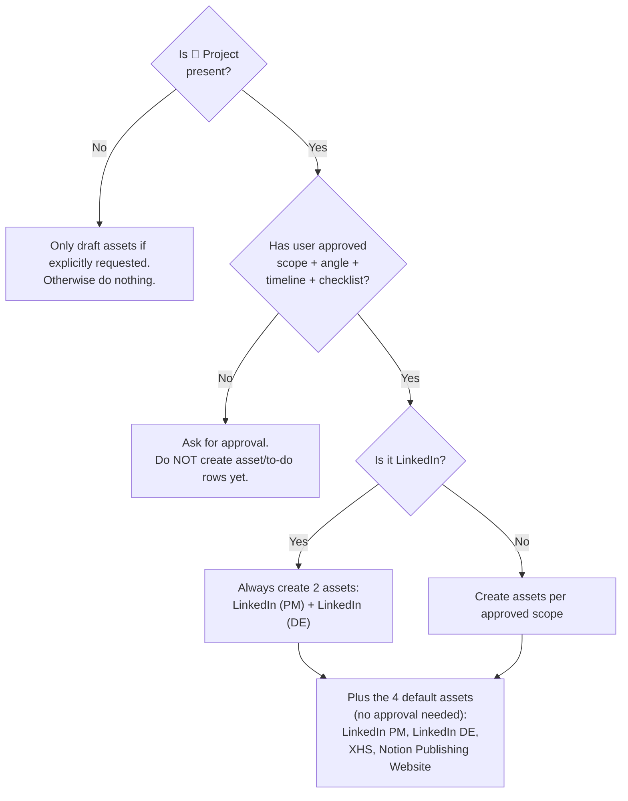

# 🧭 Quick Decision Tree

Use before writing anything.

## Decision rules in plain text

1. **Is `📣 Project` present?**
   - **No** → Only draft assets if explicitly requested; otherwise do nothing.
   - **Yes** → Continue.
2. **Has the user approved asset scope + angle + timeline + checklist?**
   - **No** → Ask for approval (do not create asset/to-do rows yet).
   - **Yes** → Create assets, then generate minimal to-dos.
3. **Is it LinkedIn?**
   - **Yes** → Always create **two assets**: LinkedIn (PM) + LinkedIn (DE).
   - **No** → Create assets per approved scope.
4. **4 default assets (always created, no approval needed):**
   - LinkedIn (PM)
   - LinkedIn (DE)
   - XHS
   - Notion Publishing Website
